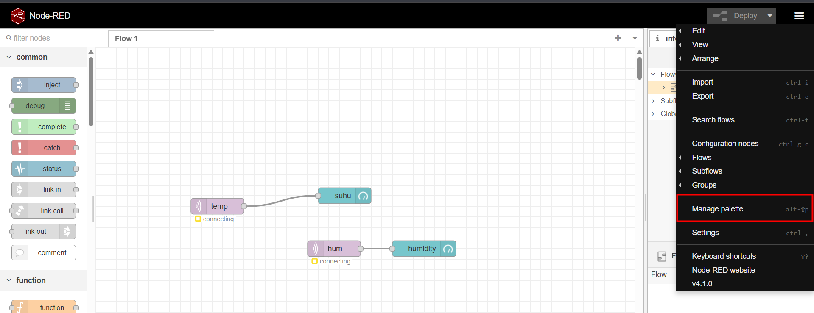

# IoT-NodeRed-MQTT
Tugas kelompok IoT integrasi dengan NodeRed menggunakan komunikasi MQTT
# Daftar Anggota
|Nama | NRP |
|-----|-----|
|Rayka Dharma Pranandita | 5027241039|
|Angga Firmansyah| 5027241062|

# Overview   
Pada project ini, IoT melakukan pengiriman data suhu dan kelembapan menggunakan sensor DHT11 melalui MQTT dengan mosquittoMQTT yang selanjutnya divisualisasikan menggunakan node-red dashboard. List komponen dan wiring dari project IoT ini yaitu:    
- DHT11 Sensor (VCC->3.3V, DATA->GPIO 4, GND->GND)
- ESP32
- 3 Kabel Jumper Male to Male
  
Aplikasi yang digunakan:
 - node-red
 - mosquitto MQTT

# Alur Kerja:
## Mengunduh aplikasi dan setup (jika diperlukan):
### Install mosquitto MQTT
Pertama, kunjungi website _https://mosquitto.org/download/_ dan download installer sesuai dengan OS yang digunakan setelah itu jalankan installer dan tunggu hingga selesai. Setelah selesai, kita lakukan konfigurasi pada mosquitto dengan cara masuk ke directory mosquitto dan lakukan penambahan pada file _mosquitto.conf_ dengan tamabahan dibagian listener berupa:
```
listener 1883
protocol mqtt
allow_anonymous true
listener 9001
protocol websockets
```
Seperti contoh sebagai berikut:    

Setelah itu jangan lupa di-save dan jalankah command ini di command prompt dalam directory mosquitto:
```shell
./mosquitto.exe -c mosquitto.conf -v
```
Setelah itu mosquitto seharusnya sudah berjalan dengan lancar
### Install node-red
Pertama, jalankan command ini pada command shell
```shell
npm install -g --unsafe-perm node-red
```
Dengan itu, node-red telah terinstall, selanjutnya bisa kita coba run dengan command ini
```shell
node-red
```
Setelah berjalan buka web node-red dan lakukan instalasi untuk dashboard dengan langkah langkah sebagai berikut:
- Buka pallete manager:
  
- Klik bagian install, lalu cari _node-red-dashboard_ dan klik tombol installnya:
  
  <br>Lakukan restart server node-red untuk memastikan instalasi berhasil sepenuhnya

## Code overview:
### Install library dan define beberapa hal crucial
```cpp
#include <WiFi.h> // untuk menghubungkan dengan Wi-Fi
#include <PubSubClient.h> // untuk melakukan transmisi MQTT
#include <DHT.h> // untuk menghubungkan dengan DHT sensor

// Konfigurasi DHT11
#define DHTPIN 4      // Pin DATA DHT11 terhubung ke pin D4 di ESP32
#define DHTTYPE DHT11
DHT dht(DHTPIN, DHTTYPE);

// Inisialisasi MQTT Client
WiFiClient espClient;
PubSubClient client(espClient);
```

### Setup Credential
```cpp
// Wi-Fi Credential
const char* ssid = "waw123";
const char* password = "kwekkwek";

// IP MQTT Server
const char* mqtt_server = "10.65.251.71"; 
```

### Setup Wifi
```cpp
void setup_wifi() {
  delay(10);
  Serial.println();
  Serial.print("Menghubungkan ke WiFi: ");
  Serial.println(ssid);
  WiFi.begin(ssid, password);
  while (WiFi.status() != WL_CONNECTED) {
    delay(500);
    Serial.print(".");
  }
  Serial.println("\nWiFi terhubung!");
  Serial.print("IP address ESP32: ");
  Serial.println(WiFi.localIP());
}
```
Membuat fungsi yang akan melakukan koneksi dengan Wi-FI

### Fungsi reconnect()
```cpp
void reconnect() {
  while (!client.connected()) {
    Serial.print("Mencoba koneksi ke MQTT Broker...");
    if (client.connect("ESP32_DHT11_Client_V2")) { 
      Serial.println("terhubung ke broker lokal!");
    } else {
      Serial.print("gagal, kode error rc=");
      Serial.print(client.state());
      Serial.println(" | Coba lagi dalam 5 detik");
      delay(5000);
    }
  }
}
```
FUngsi ini berguna ebagai helper/penanda saat gagal terhubung dengan mqtt server

### Fungsi setup()
```cpp
void setup() {
  Serial.begin(115200);
  dht.begin();
  setup_wifi();
  client.setServer(mqtt_server, 1883); 
}
```
Pada saat pertama kali menyala (setup) akan melakukan melakukan komunikasi serial pada baud rate 115200 dan menginisialisasi dht, setup Wi-FI dan menset client server sesuai kredensial mqtt server dengan port 1883

### Fungsi loop()
```cpp
void loop() {
  if (!client.connected()) {
    reconnect();
  }
  client.loop();

  long now = millis();
  if (now - lastMsg > 5000) {
    lastMsg = now;

    float humidity = dht.readHumidity();
    float temperature = dht.readTemperature();

    if (isnan(humidity) || isnan(temperature)) {
      Serial.println("Gagal membaca data dari sensor DHT11!");
      return;
    }

    // 1. Ubah nilai float suhu ke string, lalu kirim ke topic "temp"
    dtostrf(temperature, 1, 2, tempString); // (float, min width, precision, buffer)
    Serial.printf("Kirim ke topic 'temp': %s \n", tempString);
    client.publish("temp", tempString);

    // 2. Ubah nilai float kelembapan ke string, lalu kirim ke topic "hum"
    dtostrf(humidity, 1, 2, humString);
    Serial.printf("Kirim ke topic 'hum': %s \n", humString);
    client.publish("hum", humString);
    // -------------------------
  }
}
```
Self explanatory, intinya kode pada loop ini akan memastikan koneksi MQTT, mencatat data sensor, mengubah nilai float data sensor ke string terakhir mengirimnya ke mqtt server sesuai topik 

## node-red nodes configuration:
Sekarang kita masuk ke web node-red dan melakukan konfigurasi nodes, untuk nodes yang digunakan sendiri meliputi:
- temp (MQTT In) yang terhubung dengan suhu (gauge):
  - **Configuration temp (MQTT In):**
    <br>
    
    <br>
  - **Configuration suhu (gauge):**
    <br>
    
    <br>
- hum (MQTT In) yang terhubung dengan humidity (gauge)
  - **Configuration temp (MQTT In):**
    <br>
    
    <br>
  - **Configuration suhu (gauge):**
    <br>
    
    <br>
Setelah itu seharusnya data sensor DHT11 sudah bisa dikirim oleh ESP32 ke node-red, dan visualisasi data bisa dilihat di dashbord dengan url  _localhost:1880/ui_. Berikut dashboard kami dan juga catatan log di mosquitto serta serial monitor:


## Dokumentasi Wiring

